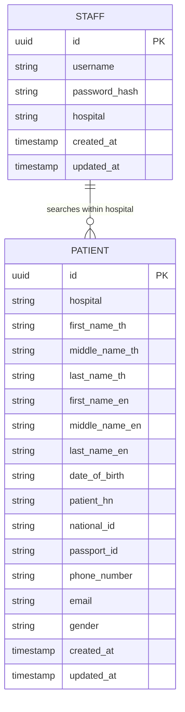

# Hospital Middleware — Development Planning Document

## 1. Project Structure

```
gin-hospital-middleware/
├── cmd/
│   ├── server/              # Main API entrypoint
│   └── mock-hospital-a/     # Mock Hospital A HIS API (Docker internal)
├── internal/
│   ├── auth/                # JWT token generation and parsing
│   ├── config/              # Environment variable configuration
│   ├── database/            # PostgreSQL connection and schema migration
│   ├── handlers/            # Gin HTTP handlers (/staff, /patient)
│   ├── hospital/            # HTTP client for external HIS APIs
│   ├── middleware/          # JWT authentication middleware
│   ├── models/              # Staff and Patient entities
│   ├── repository/          # Database access layer (GORM)
│   ├── router/              # Route registration
│   ├── service/             # Business logic
│   └── testutil/            # Shared test setup
├── docs/
│   └── planning.md          # This document
├── nginx/
│   └── nginx.conf           # Reverse proxy to Go service
├── docker-compose.yml       # nginx + app + postgres + mock-hospital-a
├── Dockerfile
├── Dockerfile.mock-hospital
└── .env.example             # Local environment template
```

### Architecture flow

```
Staff Client
    → Nginx (:8088)
    → Gin API (handler → service → repository)
        → PostgreSQL (cache staff + patients)
        → Hospital A HIS (GET /patient/search/{id}) when national_id or passport_id provided
```

## 2. API Specification

### POST /staff/create

Register a hospital staff account.

**Request:**
```json
{
  "username": "nurse01",
  "password": "secret12",
  "hospital": "hospital-a"
}
```

**Responses:**
| Status | Meaning |
|--------|---------|
| 201 | Staff created |
| 400 | Validation error (missing fields, password < 6 chars) |
| 409 | Username already exists for this hospital |

### POST /staff/login

Authenticate staff and receive a JWT.

**Request:** same fields as create (without storing new user).

**Responses:**
| Status | Meaning |
|--------|---------|
| 200 | Returns `token`, `username`, `hospital` |
| 400 | Missing required fields |
| 401 | Invalid username or password |

### POST /patient/search

Search patients scoped to the logged-in staff member's hospital.

**Headers:** `Authorization: Bearer <jwt>`

**Request (all fields optional):**
```json
{
  "national_id": "1234567890123",
  "passport_id": "AB1234567",
  "first_name": "Somchai",
  "middle_name": "",
  "last_name": "Jaidee",
  "date_of_birth": "1990-01-15",
  "phone_number": "0812345678",
  "email": "somchai@example.com"
}
```

**Responses:**
| Status | Meaning |
|--------|---------|
| 200 | `{ "patients": [...] }` |
| 400 | Invalid JSON body |
| 401 | Missing, malformed, or expired JWT |
| 500 | HIS API or database error |

**Behavior:**
- When `national_id` or `passport_id` is provided, middleware calls Hospital A API, upserts result into PostgreSQL, then filters.
- Results are always limited to `patient.hospital = staff.hospital` from JWT.

### External: GET /patient/search/{id} (Hospital A HIS)

Called server-to-server by middleware, not by staff directly.

```
GET https://hospital-a.api.co.th/patient/search/{id}
```

`{id}` = `national_id` or `passport_id`.

## 3. Entity-Relationship Diagram



**Constraints:**
- Unique index on (`username`, `hospital`) for staff.
- Patients belong to one hospital via `hospital` column.
- Staff JWT embeds `hospital` claim; search queries filter by it.
